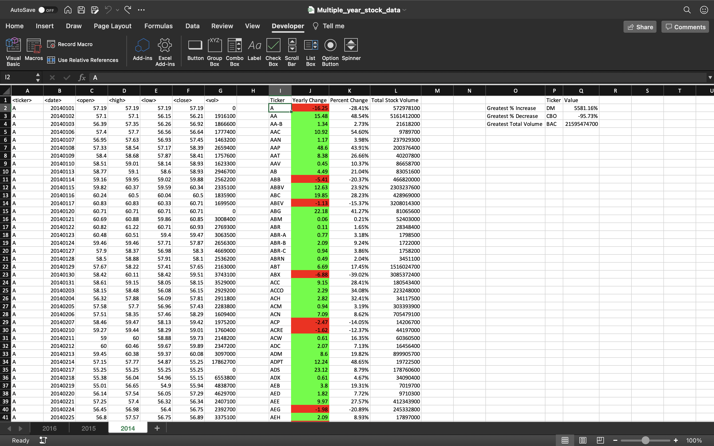
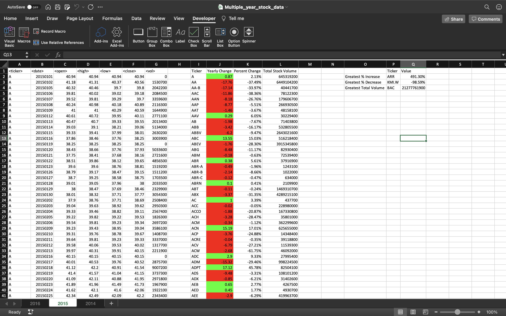
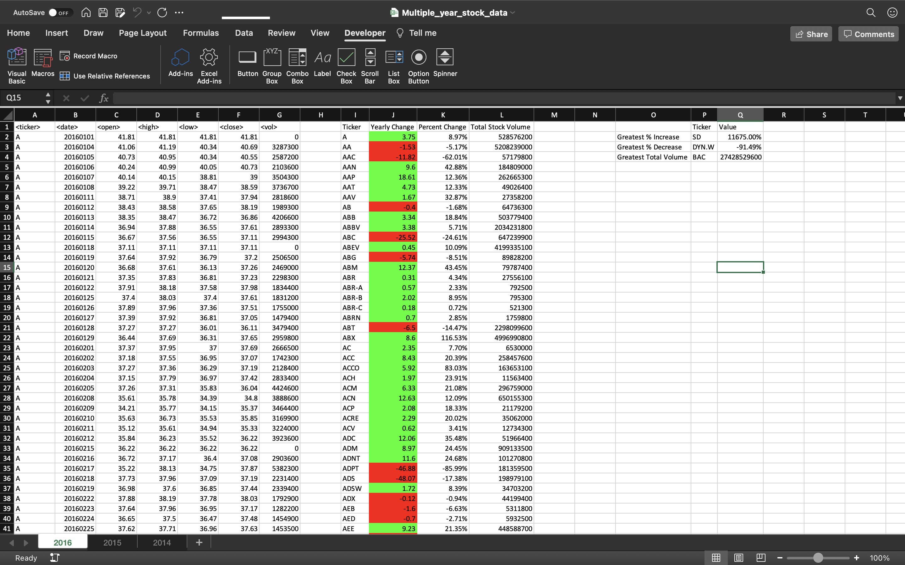

# VBA-challenge

## Description

This code uses VBA to run through a sample stock data file to generate a summary table that aggregates metrics by the stock ticker. 

The code also provides additional data on tickers with greatest percent increase or decrease in stock price as well as the ticker that had the largest stock volume that year.

## How to Run Code

Clone this repository and run the provided VBA script in the stock data file. The code should automatically run through each year (worksheet).

## Results

Screenshot of year 2014:

Screenshot of year 2015:

Screenshot of year 2016:

Written By: Anna Chee